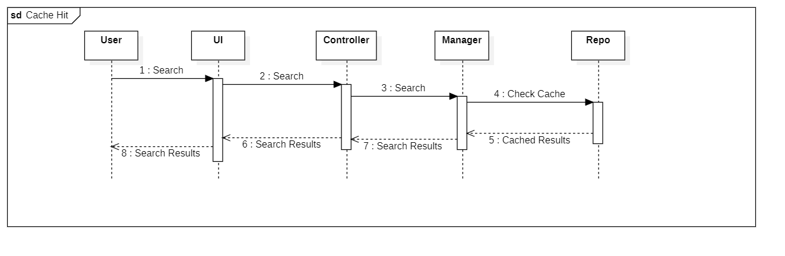

# Open Library Book Search Service

The purpose of this project is to build a UI and backend service to execute searches against the Open Library Book Search
API, cache the results of the search and serve them to the user.

## Backend Service Architecture
This service is written in Java using the Spring Boot framework to easily deliver a REST API and database services.
Using the framework-standard controller -> manager -> repository, we can separate the concerns of API delivery, business 
logic, and database access.

The database chosen for this project is PostgreSQL.  The needs for the database are very limited since it just stands
as a mechanism for holding cache results that only need to be retrieved by a key of the search term.  While the framework 
is in place to use the JPA ORM capabilities in Spring Boot to communicate with the database, I chose to forgo that
since there are only two database operations in this application and one of them couldn't have been done with JPA
unless I had done multiple round trip operations.

The communication with OpenLibrary is done using a Feign interface which allows web requests to be defined declaratively
using an interface and some annotations and allowing the Feign library to manage all the complexity of executing the 
request and unmarshalling the return data.

## Frontend Architecture
I chose to use Angular with Typescript and Angular Material for this.  It's a very flexible UI framework and was easy
to build and modify to add the code for getting the book data and the UI for displaying it.

## Interactions
There is only one interaction in this system, which is the search for books based on a search term.  This can be 
expressed with two different flows based on whether the data desired is valid within the cache.  Here are the two
flows:

Both flows are the same until the result from the cache check is retrieved.  If the data is present and valid, that data
is returned back through the call stack.  If it is not present, then the data is retrieved from the OpenLibrary client,
cached, and then returned.

## TODO
Add a reaper that runs on a schedule to clean up the invalid cache entries.  This is needed to prevent unbounded
database growth but isn't needed for an interview demo.